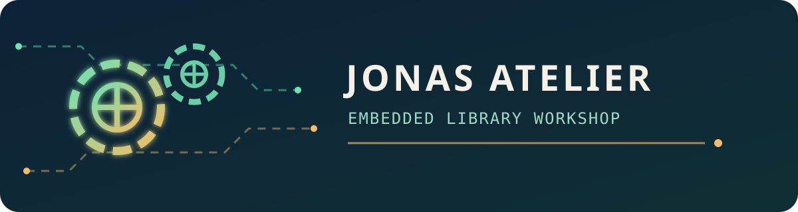

  

<h1 align="center">Embedded Library Workshop</h1>

  Portable C libraries and hardware projects, organized for quick discovery.

  ✅ Available · 🧪 Hardware validation · 🚧 On-going · 🧭 Coming soon

<pre>
Jonas Atelier
├── ⚡ ESP32 / ESP-IDF
│   ├── Actuators
│   │   └── esp32-c620-control — C620 motor control 🧪
│   │
│   ├── Sensors
│   │   ├── esp32-bmi088-imu — BMI088 IMU interface 🧪
│   │   └── esp32-ina2xx-sensor — INA2xx power monitor 🧪
│   │
│   ├── Input &amp; Controllers
│   │   └── esp32-ps-controller — PS4/PS5 controller input 🧪
│   │
│   ├── Communications
│   │   ├── esp32-sn65hvd230-can — CAN transceiver driver 🧪
│   │   └── esp32-dw1000-uwb — DW1000 UWB ranging 🧪
│   │
│   ├── Camera
│   │   └── Coming soon 🧭
│   │
│   └── Algorithms &amp; Filters
│       ├── esp32-kalman-filter — Scalar Kalman filter 🧪
│       ├── esp32-complementary-filter — Complementary filter 🧪
│       └── esp32-particle-filter — Particle filter 🧪
│
├── 🔷 STM32
│   └── Coming soon 🧭
│
├── ♾️ Arduino
│   └── Coming soon 🧭
│
├── 🐧 Linux
│   └── Coming soon 🧭
│
├── 🧰 General
│   └── Control &amp; Algorithms
│       └── upid — Portable PID control 🧪
│
└── 🛠️ Misc
    ├── Robomaster_controller — RoboMaster controller 🚧
    └── Dingo — Hardware project 🚧
</pre>

  Projects become clickable after hardware validation and public release.
   
  Built in the
  <a href="https://github.com/JonasAtelier">Jonas Atelier</a> workshop.

