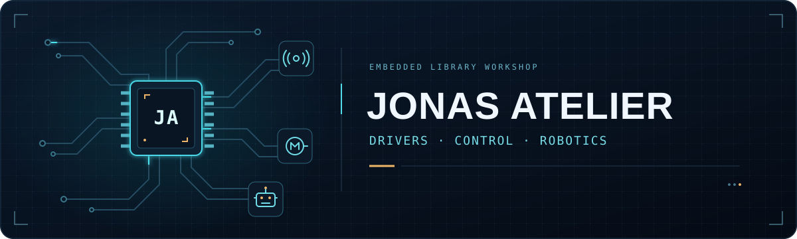

  

<h1 align="center">Embedded Library Workshop</h1>

  <strong>Find a driver. Pick a library. Build your next project.</strong>

Reusable C libraries, ESP32 drivers, and robot projects from Jonas Atelier.
This repo is the catalog; each project keeps its code and setup instructions
in its own repository.

## Start here

| Want to… | Open |
|---|---|
| Control a motor, heater, or other feedback loop | [upid — portable PID controller](https://github.com/JonasAtelier/upid) |
| Connect an ESP32 to a CAN bus | [esp-sn65hvd230-can — CAN interface](https://github.com/JonasAtelier/esp-sn65hvd230-can) |

These repos are public. Open a project for its requirements, examples, and
validation status.

## Browse the workshop

Expand a category to explore. **✅ Available · 🧪 Validation pending · 🚧 In development · 🧭 Planned**

⚡ ESP32 / ESP-IDF

| Project | Use it for | Status |
|---|---|---|
| `esp-c620-control` | C620 motor control | 🧪 |
| `esp-tmc5240-stepper` | TMC5240 stepper driver | 🧪 |
| `esp-tmc2209-stepper` | TMC2209 stepper, UART | 🚧 |
| `esp-drv8323-gatedriver` | DRV8323 BLDC gate driver | 🚧 |
| `esp-pca9685-pwm` | PCA9685 16-ch PWM | 🧪 |
| `esp-servo-pwm` | RC servos on LEDC, no extra chip | 🚧 |
| `esp-bmi088-imu` | BMI088 IMU interface | 🧪 |
| `esp-icm45686-imu` | ICM-45686 IMU interface | 🧪 |
| `esp-mpu6050-imu` | MPU-6050 IMU interface | 🧪 |
| `esp-bno085-imu` | BNO085 IMU interface | 🧭 |
| `esp-icm42688-imu` | ICM-42688 IMU interface | 🧭 |
| `esp-qmc5883l-mag` | QMC5883L magnetometer | 🧪 |
| `esp-mmc5983-mag` | MMC5983MA magnetometer | 🧭 |
| `esp-ld19-lidar` | LD19/LD06 LiDAR, UART | 🚧 |
| `esp-tfmini-lidar` | TFmini LiDAR interface | 🧭 |
| `esp-vl53l1x-tof` | VL53L1X ToF sensor | 🚧 |
| `esp-ublox-gnss` | u-blox M8/M10 GNSS | 🧭 |
| `esp-as5600-encoder` | AS5600 magnetic encoder | 🚧 |
| `esp-as5047p-encoder` | AS5047P SPI encoder, FOC | 🚧 |
| `esp-amt102-encoder` | AMT102-V quadrature, PCNT | 🚧 |
| `esp-as5048a-encoder` | AS5048A magnetic encoder | 🧭 |
| `esp-dps310-baro` | DPS310 barometer | 🧪 |
| `esp-ms5611-baro` | MS5611 barometer, I2C | 🚧 |
| `esp-hx711-loadcell` | HX711 load cell amplifier | 🧪 |
| `esp-nau7802-loadcell` | NAU7802 bridge ADC, I2C | 🧪 |
| `esp-ina2xx-sensor` | INA2xx power monitor | 🧪 |
| `esp-max17048-fuelgauge` | MAX17048 1S fuel gauge | 🧪 |
| `esp-bq769x0-bms` | bq769x0 3-15S pack monitor | 🧪 |
| `esp-ps-controller` | PS4/PS5 controller input | 🧪 |
| `esp-crsf-rc` | CRSF/ELRS RC receiver, UART | 🧪 |
| `esp-mcp23-expander` | MCP23017 I/O expander | 🚧 |
| `esp-ads1115-adc` | ADS1115 4-ch 16-bit ADC | 🧪 |
| `esp-tca9548a-mux` | TCA9548A I2C multiplexer | 🧭 |
| `esp-ssd1306-oled` | SSD1306 OLED display, I2C | 🧪 |
| `esp-ws2812-led` | WS2812 RGB LEDs, RMT | 🚧 |
| [esp-sn65hvd230-can](https://github.com/JonasAtelier/esp-sn65hvd230-can) | ESP32 CAN bus interface | 🧪 |
| `esp-mcp2515-can` | MCP2515 CAN over SPI | 🧪 |
| `esp-dw1000-uwb` | DW1000 UWB ranging | 🧪 |
| `esp-espnow-link` | ESP-NOW packets between boards | 🚧 |
| `esp-ota-wifi` | On-demand Wi-Fi OTA update | 🧪 |
| `esp-sdlog` | Buffered SD-card logger | 🚧 |

🧰 Portable C

| Project | Use it for | Status |
|---|---|---|
| [upid](https://github.com/JonasAtelier/upid) | Portable PID control | ✅ |
| `adrc` | Active disturbance rejection | 🚧 |
| `lqr` | Discrete-time LQR gains | 🚧 |
| `bt` | Behaviour trees | 🚧 |
| `fsm` | Finite state machines | 🧪 |
| `kin` | Forward/inverse kinematics | 🧪 |
| `mob` | Wheel kinematics & odometry | 🚧 |
| `dyn` | Arm dynamics, gravity comp | 🚧 |
| `path` | Spline path & pure pursuit | 🚧 |
| `imp` | Impedance & admittance control | 🧪 |
| `foc` | Field-oriented control maths | 🧪 |
| `traj` | Trapezoidal & S-curve profiles | 🧭 |
| `f_kalman` | Scalar Kalman filter | 🧪 |
| `f_complementary` | Complementary filter | 🧪 |
| `f_particle` | Particle filter | 🧪 |
| `f_madgwick` | Madgwick AHRS filter | 🚧 |
| `f_ekf` | Extended Kalman | 🚧 |
| `f_rls` | Recursive least sq. | 🚧 |
| `f_hampel` | Hampel filtering | 🧭 |

🐧 Linux

| Project | Use it for | Status |
|---|---|---|
| `nv-ps-controller` | PS4/PS5 controller input | 🚧 |
| `rs-d455-camera` | RealSense D455 camera | 🧭 |
| `Robust` | ROS2-style C framework | 🚧 |

🤖 Robot projects

| Project | Use it for | Status |
|---|---|---|
| `Hawk` | Drone | 🧭 |
| `Hawk_control` | ROS 2 drone control, PS4-driven | 🚧 |
| `Dingo` | Robotic dog | 🧭 |
| `dingo_s3` | ESP32-S3 Dingo firmware; not verified on robot hardware | 🚧 |
| `flux_s3` | ESP32-S3 sensored FOC drive, esp-forge app | 🚧 |
| `nova_s3` | ESP32-S3 swerve module | 🚧 |
| `Arachne` | Spider robot | 🧭 |
| `Navis` | AGV | 🧭 |
| `Helios` | Humanoid robot | 🧭 |
| `Jarvis` | Robotic arm | 🧭 |

🔨 Build tools

| Project | Use it for | Status |
|---|---|---|
| `esp-forge` | Fetch an ESP-IDF app and selected libraries, then build firmware | 🚧 |
| `stm-forge` | Fetch an STM32 app and selected libraries, then build firmware | 🚧 |
| `rmboard_f427` | RoboMaster Board A bring-up app for stm-forge | 🚧 |

**Also planned:** Arduino and ESP32 camera projects.

Links point to public repositories. Public availability does not imply hardware
validation; check each project's README before using it.
